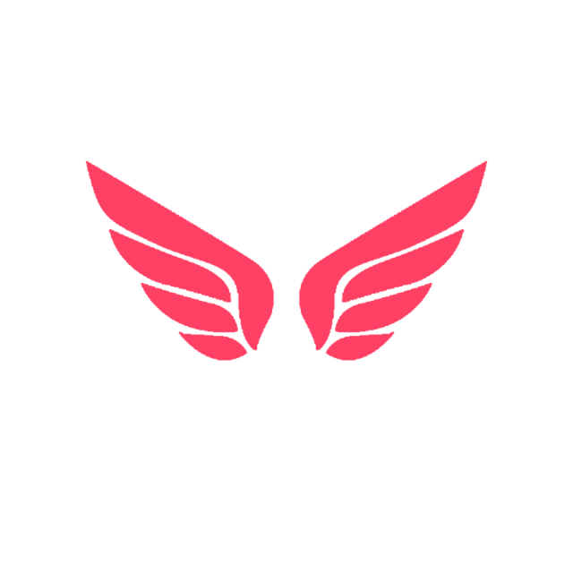

<h1 align="left">AngeliQ Web</h1>
<div className="width: 100%">
  
</div>
<p>
  
  
  <a href="#" target="_blank">
    
  </a>
  <a href="https://twitter.com/bilo\_io" target="_blank">
    
  </a>
</p>

[](https://standardjs.com/)

> React Web App. AngeliQ online dating service.

### 🏠 [Homepage](.)

## Prerequisites

- node 12

## Install

```sh
yarn
```

## Usage

```sh
yarn run start
```

## Run tests

```sh
yarn test
```

## Author

👤 **Bilo Lwabona**

* Twitter: [@bilo\_io](https://twitter.com/bilo\_io)
* Github: [@bilo-io](https://github.com/bilo-io)
* LinkedIn: [@bilolwabona](https://linkedin.com/in/bilolwabona)