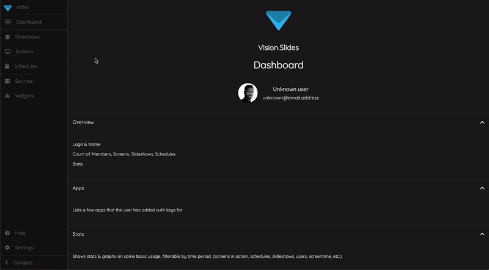
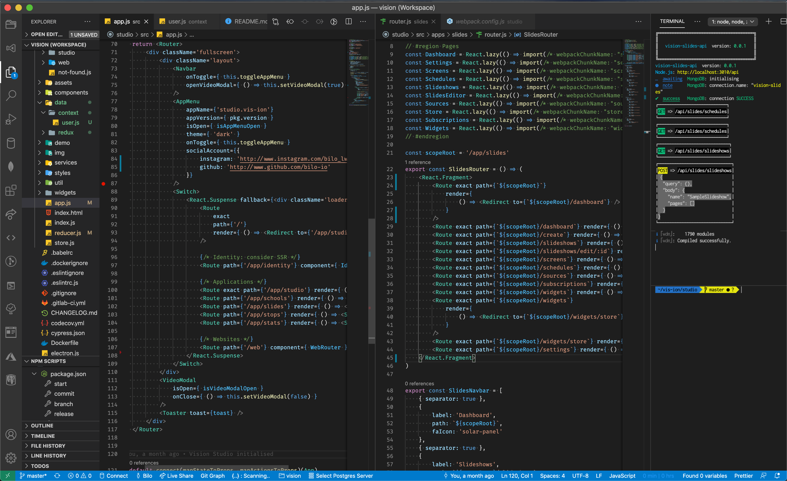
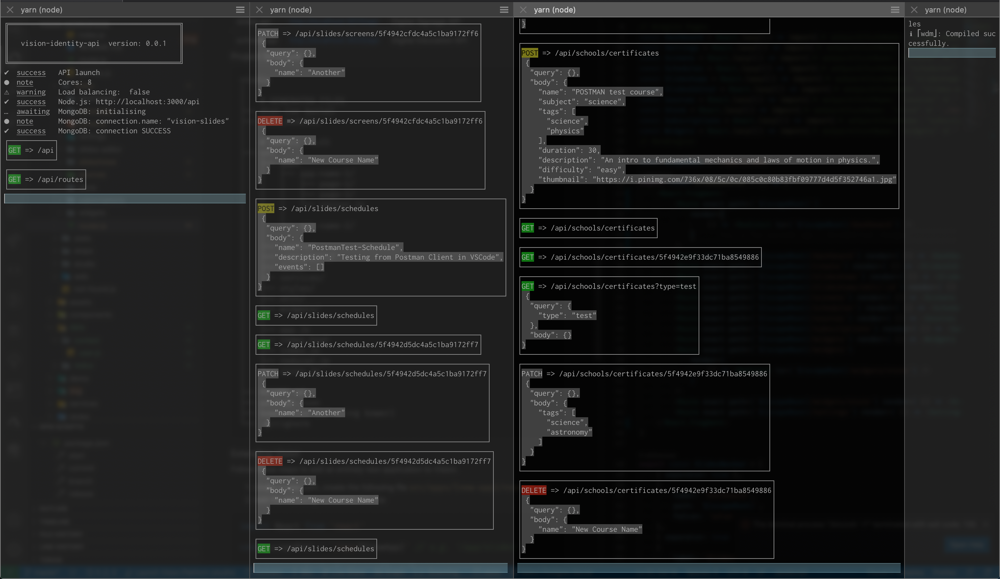
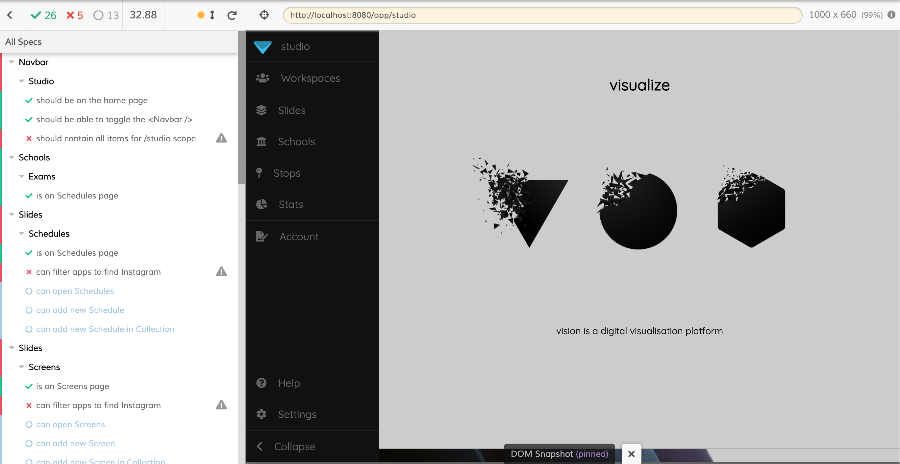
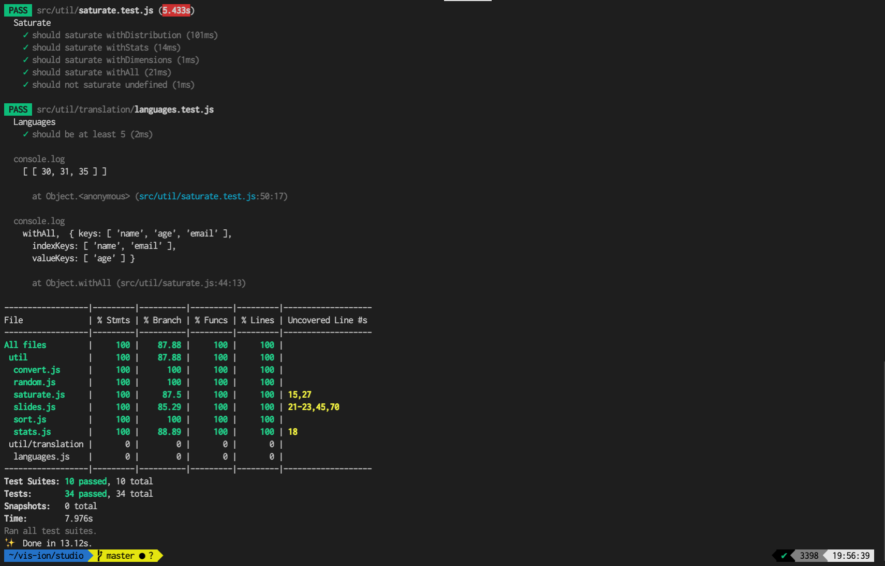
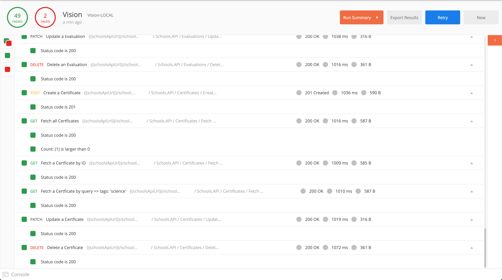
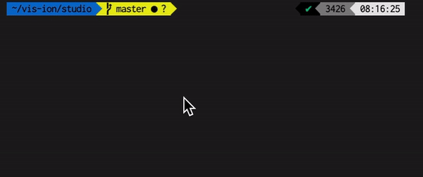
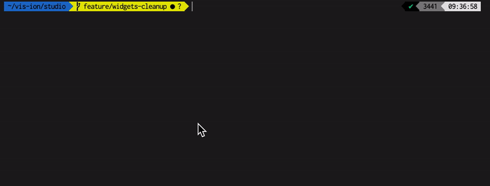

# Vision Studio

[](https://gitlab.com/vis-ion/studio/-/pipelines)
[]()
[](https://standardjs.com/)
[](./CODE_OF_CONDUCT.md)
[](./LICENSE.md)

An extensible, React & Node based visualisation platform.

### Technologies

The relevant technologies include, but are not limited to the following:

|Name|Description|
|:-|:-|
|[React](https://reactjs.org/)|UI Library|
|[Redux](https://redux.js.org/)|State management|
|[SASS](https://sass-lang.com/)|CSS Precompiler|
|[ESLint](https://eslint.org/)|Static code analysis|
|[Storybook](https://storybook.js.org/docs/react/get-started/install/)|Code documentation|
|[Jest](https://jestjs.io/)|Unit testing|
|[Cypress](https://www.cypress.io/)|E2E Testing|
|[Webpack](https://webpack.js.org/)|Bundling|


### Quickstart

- `yarn`
- `yarn build`
- `yarn start`

> - `yarn start` runs `npm run dev` (web app) `&` `npm run serve` (web api)
> - web app: [http://localhost:8080/app](http://localhost:8080/app)


## Slides App

 1. `app/slides/slideshows`: Create Slideshows composed of static, dynamic and interactive widgets.


2. `app/slides/screens`:  Attach the slideshows to physical screens, through the cloud.


3. `app/slides/schedules`: Schedule which slideshows should play, and assign schedules to screens arbitrarily.


> WIP:
> - Schools App (basic eLearning application)
> - Stats App (basic number crunching dashboards)

### Architecture

Microservice (and soon Microfrontend) architecture.

### Backend APIs:

|App|Dev URL|Description|
|:-|:-|:-|
|identity.api | [http://localhost:3000/api](http://localhost:3000/api) |Identity Server (OAuth)|
|slides.api | [http://localhost:3010/api](http://localhost:3010/api) |Digital Signage API|
|schools.api | [http://localhost:3020/api](http://localhost:3020/api) |Digital Education API|

### Project Structure

```
studio
│
│   # GENERATED FILES
├── dist (or build)
├── node_modules
│
│   # SOURCE FILES
├── src
│   ├── apps
│   │   ├── app-name-1/
│   │   │   ├── page-1/
│   │   │   ├── page-1/
│   │   │   └── router.js
│   │   │
│   │   └── app-name-2/
│   │
│   ├── assets/
│   ├── components/
│   ├── data/
│   ├── services/
│   ├── styles/
│   ├── util/
│   ├── widgets/
│   │
│   ├── app.js
│   ├── index.html
│   ├── index.js
│   ├── reducer.js
│   └── store.js
│
├── README.md
├── package.json
├── bower.json (if using bower)
└── .gitignore
```

## Development

Recommended development environment is with VSCode, and various extensions.

> NOTE: There is a `launch.json` which fires up an Applescript ( `osascript ../vision-platform-dev.scpt`) that launches all services required to run the platform, locally, when you press "Play" in the debug view of VSCode.



> Further more, this is the resulting launched `iTerm` view, where the various backend services are running, as documented below


### Storybook

Storybook is also used to work on components in isolation.

> `yarn dev:storybook`
> 

### Extending Vision

Follow these steps to add an entirely new application to Vision.

1. Under a new path, create the following file `src/apps/{new-app}/router.js`
2. Add the following content to this file:

```jsx
import React from 'react'

const scopeRoot = `/app/${newApp}` // e.g. '/app/slides'

export const NewAppRouter = () => {

    return <>
        <Route path={`${scopeRoot}`} render={ () => <h1>New App Route</h1> } />
    </>
}
```

3. Add your router to the app router in `src/app.js`:
```jsx
render () {
    return <Router>
        <Switch>
            {/* Apps */}
            <Route path={`/app/slides`} component={ SlidesRouter } />
            <Route path={`/app/schools`} component={ SchoolsRouter } />
            {/*
                ...
                ADD ROUTE HERE
                ...
            */}
            <Route path='*' component={ NotFound } />
            </Switch>
    </Router>
}
```

4. Add the navbar for your route, in the `scopeRoot` is defined in the `router.js`.

```jsx
// ...
const scopeRoot = `/app/${newApp}` // e.g. '/app/slides'

export const NewAppNavbar = [
    {
        label: 'New App Home',
        path: `${scopeRoot}/`,
        faIcon: '{react-fontawesome-icon-name}'
    }
]

export const NewAppRouter = () => {
// ...
}
```

### Tests

For the frontend we use [cypress.io](https://www.cypress.io/) for end-to-end testing, and [Jest](https://jestjs.io/) for unit tests.

> `yarn tests:e2e`


> `yarn tests:unit`



The backend is currently being tested with a [Postman](https://www.postman.com/) collection.



### Source Control

This repo uses a feature-branch `git` workflow. To assist with this, we use `./scripts`, such as:

- `yarn branch`

> follow prompts to createa a `feature`, `hotfix` branch.
> 

- `yarn commit`

> follow prompts to create a consistent commit structure.
> 

- `yarn release`

> follow prompts to create a consistent release (with git tag, etc.)
> 
